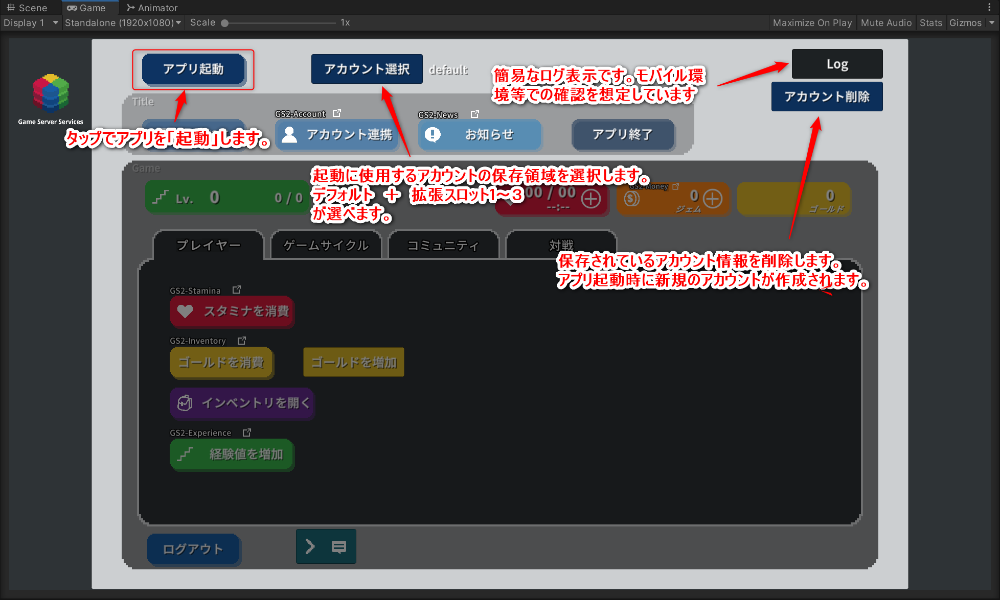
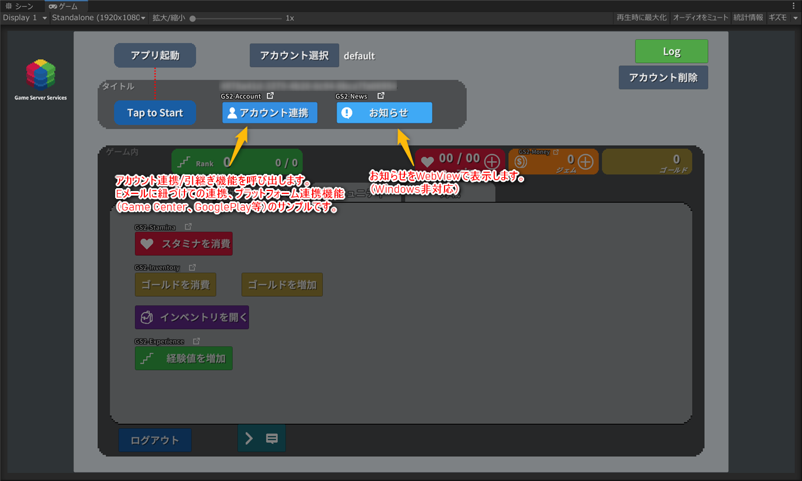
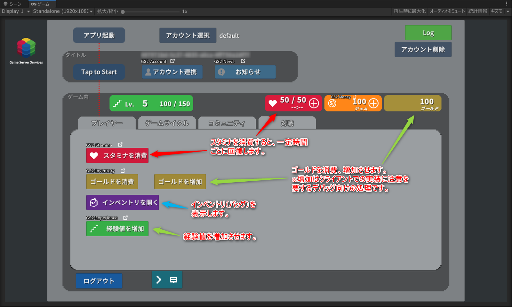
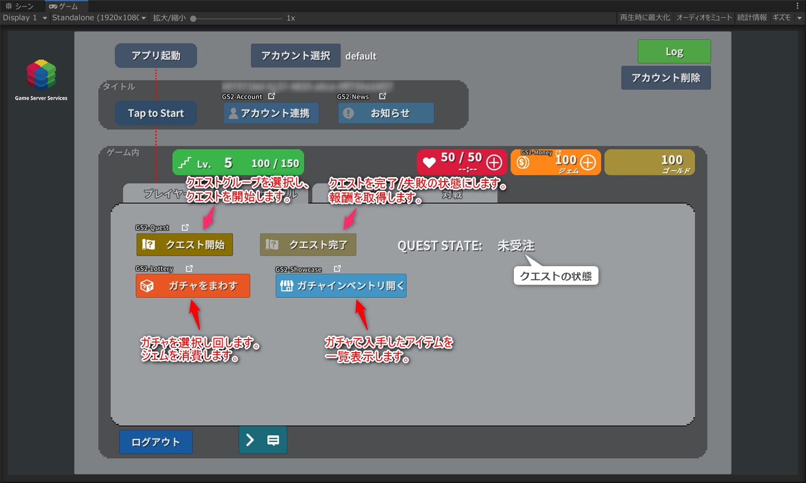
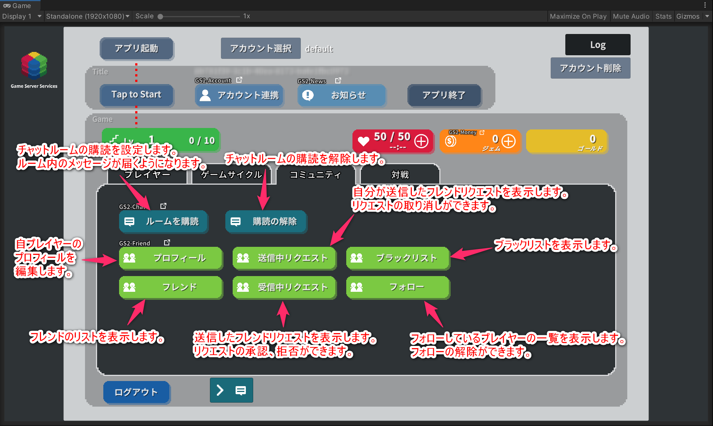
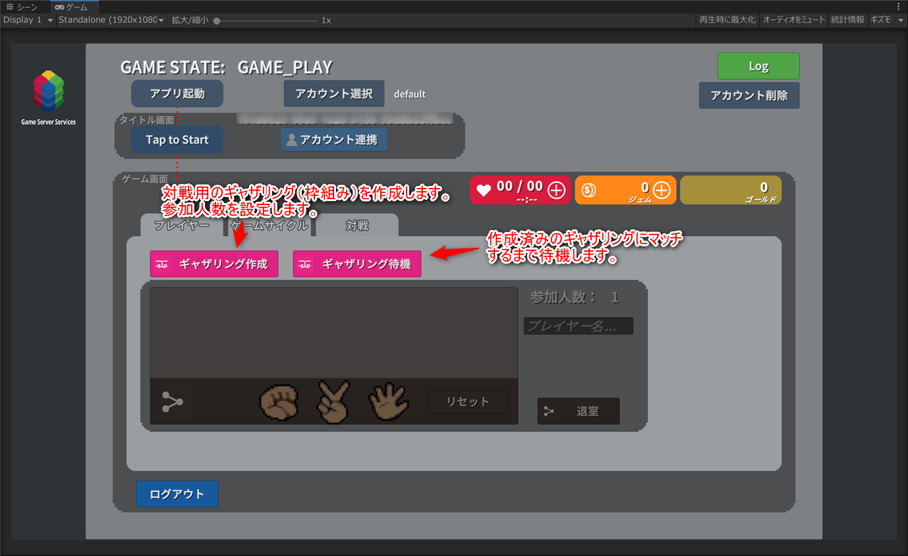

[⇒README in English](README-en.md)

# GS2 Sample Project for Unity

Game Server Services (https://gs2.io) の Unity 向けのサンプルプロジェクトです。  
ゲームでの大まかな流れを想定した GS2の各種機能を使った実装サンプルです。

## 動作環境

Unity 2019.4.40f1

GS2 SDK for Unity　2022.7.3  
GS2 C# SDK　2022.7.3

## 注意事項

・サンプルに含まれるmanifest.json、packages-lock.jsonファイルには、  
GS2のSDKのほか、Unity2019.4上での動作に必要なパッケージの記述が含まれます。  
上記以外のUnityバージョンでプロジェクトを開くと、  
エラーが発生しパッケージのバージョン変更が必要になる場合があります。  
その際は、パッケージマネージャーで検証済みバージョンをインストールすることで  
動作が可能になります。  

・TextMeshPro用の日本語フォントに  
 「Noto Sans Japanese」（ https://fonts.google.com/noto/specimen/Noto+Sans+JP ）  
を使用しています。  
Licensed under SIL Open Font License 1.1 ( http://scripts.sil.org/OFL )  

## 機能別の解説

各機能を単独で動作させる方法、機能の詳細については以下のページで個別に解説しています。

- [アカウントの作成・ログイン 解説 (GS2-Account / GS2-Auth / GS2-Gateway)](Docs/Login.md)
- [バージョンチェック 解説 (GS2-Version)](Docs/Version.md)
- [アカウント引継ぎ 解説 (GS2-Account)](Docs/Takeover.md)
- [お知らせ 解説 (GS2-News)](Docs/News.md)
- [スタミナ/スタミナストア 解説 (GS2-Stamina)](Docs/Stamina.md)
- [課金通貨/課金通貨ストア 解説 (GS2-Money / GS2-Showcase)](Docs/Money.md)
- [ゴールド/インベントリ 解説 (GS2-Inventory)](Docs/Inventory.md)
- [経験値 解説 (GS2-Experience)](Docs/Experience.md)
- [クエスト 解説 (GS2-Quest)](Docs/Quest.md)
- [抽選機能 解説 (GS2-Lottery)](Docs/Lottery.md)
- [チャット 解説 (GS2-Chat)](Docs/Chat.md)
- [フレンド 解説 (GS2-Friend)](Docs/Friend.md)
- [マッチメイキング 解説 (GS2-Matchmaking)](Docs/Matchmaking.md)
- [リアルタイム 解説 (GS2-Realtime)](Docs/Realtime.md)

## 起動の準備

ここではUnity Editor上でPlayボタンでゲームを再生するまでの準備について扱います。

### Unity でプロジェクトを開く

Unityで`gs2io/gs2-sample-project` をプロジェクトとして開きます。  
Unity Package Manager により、依存関係の解決に必要なパッケージのダウンロードが行われます。  
GS2 SDK for Unity、GS2 C# SDKのダウンロード、インストールが行われます。

Assets/Scenes/SampleGameScene.unity シーンを開きます。

Textの描画にTextMeshProを使用しています。  
シーンを開いた際に「TMP Importer」ウィンドウが表示されますので  
「Import TMP Essentials」をクリックし、TMP Essentialsのインポートをお願いします。  

### GS2-Deploy を使って初期設定をおこなう

[マネージメントコンソール](https://app.gs2.io/)のDeploy機能を使ってスタックの作成を行い、  
サンプルの動作に必要なリソースの準備を行います。

Templatesフォルダの以下のファイルでスタックを作成します。  

#### 必須のテンプレート

| Template files | Functions to be set |
---|---
[initialize_credential_template.yaml](Templates/initialize_credential_template.yaml) |クレデンシャル GS2の初期化
[initialize_account_template.yaml](Templates/initialize_account_template.yaml) |ログイン/アカウント連携・引継ぎ

#### 各機能の動作に必要なテンプレート

| テンプレートファイル | 設定する機能 |
---|---
[initialize_stamina_template.yaml](Templates/initialize_stamina_template.yaml) |スタミナ/スタミナストア
[initialize_money_template.yaml](Templates/initialize_money_template.yaml) |課金通貨/課金通貨ストア
[initialize_gold_template.yaml](Templates/initialize_gold_template.yaml) |ゴールド
[initialize_inventory_template.yaml](Templates/initialize_inventory_template.yaml) |インベントリ
[initialize_experience_template.yaml](Templates/initialize_experience_template.yaml) |経験値

| テンプレートファイル | 設定する機能 |
---|---
[initialize_quest_template.yaml](Templates/initialize_quest_template.yaml) |クエスト
[initialize_lottery_template.yaml](Templates/initialize_lottery_template.yaml) |抽選機能
[initialize_unit_template.yaml](Templates/initialize_unit_template.yaml) |抽選アイテム用インベントリ ※抽選機能の動作に必要
[initialize_jobqueue_template.yaml](Templates/initialize_jobqueue_template.yaml) |JobQueue機能設定 ※抽選機能の動作に必要

| テンプレートファイル | 設定する機能 |
---|---
[initialize_chat_template.yaml](Templates/initialize_chat_template.yaml) |チャット
[initialize_friend_template.yaml](Templates/initialize_friend_template.yaml) |フレンド機能

| テンプレートファイル | 設定する機能 |
---|---
[initialize_realtime_template.yaml](Templates/initialize_realtime_template.yaml) |マッチメイキング/リアルタイム対戦

※GS2-News お知らせ機能を使う場合に作成

| テンプレートファイル | 設定する機能 |
---|---
[initialize_news_template.yaml](Templates/initialize_news_template.yaml) |お知らせ

※GS2-Version バージョンチェック機能を使う場合に作成

| テンプレートファイル | 設定する機能 |
---|---
[initialize_version_template.yaml](Templates/initialize_version_template.yaml)|アプリバージョンチェック
[initialize_term_template.yaml](Templates/initialize_term_template.yaml)|利用規約チェック

しばらく待ってすべてのスタックの状態が `CREATE_COMPLETE` になればサーバ側の設定は完了です。

### Unity IAPの有効化、インポート

GS2-Moneyを使用したサンプルの動作には、Unity IAPの有効化が必要になります。  
( https://docs.unity3d.com/ja/2019.4/Manual/UnityIAPSettingUp.html )  
サービスウィンドウでのIn-App Purchasingの有効化、  
IAP パッケージのインポートを行います。  

### Settings の設定

ヒエラルキーウィンドウで `Gs2Settings`オブジェクト を選択します。

インスペクターウィンドウで GS2-Deploy で作成したリソースの情報を登録します。  
ダウンロード時は空欄になっている、以下の __太字__ の項目に、  
各スタックの「アウトプット」より必要な情報をコピー・アンド・ペーストします。

| スクリプトファイル | 設定名 | 説明 |
-----------------|------|------
| __CredentialSetting__ | __Application Client Id__ | __GS2 にアクセスするためのクレデンシャル（クライアントID）__ |
| __CredentialSetting__ | __Application Client Secret__ | __GS2 にアクセスするためのクレデンシャル（クライアントシークレット）__ |
| LoginSetting | accountNamespaceName | GS2-Account のネームスペース名 |
| __LoginSetting__ | __accountEncryptionKeyId__ | __GS2-Account でアカウント情報の暗号化に使用する GS2-Key の暗号鍵GRN__ |
| LoginSetting | gatewayNamespaceName | GS2-Gateway のネームスペース名 |

| スクリプトファイル | 設定名 | 説明 |
-----------------|------|------
| StaminaSetting | staminaNamespaceName | GS2-Stamina のネームスペース名 |
| StaminaSetting | staminaModelName | GS2-Stamina のスタミナのモデル名 |
| StaminaSetting | staminaName | GS2-Stamina のスタミナ名 |
| StaminaSetting | exchangeNamespaceName | スタミナの回復に使用する GS2-Exchange のネームスペース名 |
| StaminaSetting | exchangeRateName | スタミナの回復に使用する GS2-Exchange の交換レート名 |
| __StaminaSetting__ | __exchangeKeyId__ | __GS2-Exchange で交換処理に発行するスタンプシートの署名計算に使用する暗号鍵__ |
| StaminaSetting | distributorNamespaceName | 交換したスタミナ回復処理を配送する GS2-Distributor のネームスペース名 |
| MoneySetting | moneyNamespaceName | GS2-Money のネームスペース名 |
| MoneySetting | showcaseNamespaceName | GS2-Showcase のネームスペース名 |
| MoneySetting | showcaseName | GS2-Showcase の陳列棚名 |
| __MoneySetting__ | __showcaseKeyId__ | __GS2-Showcase で商品購入時に発行するスタンプシートの署名計算に使用する暗号鍵__ |
| MoneySetting | limitNamespaceName | 購入回数制限を実現する GS2-Limit のネームスペース名 |
| MoneySetting | distributorNamespaceName | 購入した商品を配送する GS2-Distributor のネームスペース名 |
| GoldSetting | inventoryNamespaceName | GS2-Inventory のゴールドのネームスペース名 |
| GoldSetting | inventoryModelName | GS2-Inventoryのゴールドのモデルのネームスペース名 |
| GoldSetting | itemModelName | アイテムモデルの名前 |
| __GoldSetting__ | __identifierAcquireGoldClientId__ | __ゴールドの増加が可能な権限のクライアントID__ |
| __GoldSetting__ | __identifierAcquireGoldClientSecret__ | __ゴールドの増加が可能な権限のクライアントシークレット__ |

| スクリプトファイル | 設定名 | 説明 |
-----------------|------|------
| InventorySetting | inventoryNamespaceName | GS2-Inventory のインベントリのネームスペース名 |
| InventorySetting | inventoryModelName | GS2-Inventoryのインベントリのモデルのネームスペース名 |
| __InventorySetting__ | __identifierAcquireItemClientId__ | __アイテムの増加が可能な権限のクライアントID__ |
| __InventorySetting__ | __identifierAcquireItemClientSecret__ | __アイテムの増加が可能な権限のクライアントシークレット__ |
| ExperienceSetting | experienceNamespaceName | GS2-Experience のネームスペース名 |
| ExperienceSetting | playerExperienceModelName | GS2-Experienceのプレイヤー経験値テーブルのモデル名 |
| ExperienceSetting | itemExperienceModelName | GS2-Experienceのアイテム経験値テーブルのモデル名 |
| __ExperienceSetting__ | __identifierIncreaseExperienceClientId__ | __経験値の増加が可能な権限のクライアントID__ |
| __ExperienceSetting__ | __identifierIncreaseExperienceClientSecret__ | __経験値の増加が可能な権限のクライアントシークレット__ |

| スクリプトファイル | 設定名 | 説明 |
-----------------|------|------
| QuestSetting | questNamespaceName | GS2-Quest のネームスペース名 |
| __QuestSetting__ | __questKeyId__ | __GS2-Quest で報酬の付与処理に発行するスタンプシートの署名計算に使用する暗号鍵__ |
| QuestSetting | distributorNamespaceName | 報酬を配送する GS2-Distributor のネームスペース名 |
| QuestSetting | queueNamespaceName | 報酬の付与に使用するGS2-JobQueue のネームスペース名 |
| LotterySetting | lotteryNamespaceName | GS2-Lottery のネームスペース名 |
| LotterySetting | jobqueueNamespaceName | GS2-JobQueue のネームスペース名 |
| LotterySetting | showcaseNamespaceName | GS2-Showcase のネームスペース名 |
| LotterySetting | showcaseName | GS2-Showcase の陳列棚名 |
| __LotterySetting__ | __showcaseKeyId__ | __GS2-Showcase で商品購入時に発行するスタンプシートの署名計算に使用する暗号鍵__ |
| __LotterySetting__ | __lotteryKeyId__ | __GS2-Lottery で商品購入時に発行するスタンプシートの署名計算に使用する暗号鍵__ |
| UnitSetting | inventoryNamespaceName | GS2-Inventory の抽選アイテム専用インベントリのネームスペース名 |
| UnitSetting | inventoryModelName | GS2-Inventoryの抽選アイテム専用インベントリのモデルのネームスペース名 |
| __UnitSetting__ | __identifierAcquireUnitClientId__ | __アイテムの増加が可能な権限のクライアントID__ |
| __UnitSetting__ | __identifierAcquireUnitClientSecret__ | __アイテムの増加が可能な権限のクライアントシークレット__ |

| スクリプトファイル | 設定名 | 説明 |
-----------------|------|------
| ChatSetting | chatNamespaceName | GS2-Chat のネームスペース名 |
| ChatSetting | roomName | GS2-Chat のルーム名 |
| FriendSetting | friendNamespaceName | GS2-Friend のネームスペース名 |

| スクリプトファイル | 設定名 | 説明 |
-----------------|------|------
| MatchmakingSetting | matchmakingNamespaceName | GS2-Matchmaking のネームスペース名 |
| RealtimeSetting | realtimeNamespaceName | GS2-Realtime のネームスペース名 |

| スクリプトファイル | 設定名 | 説明 |
-----------------|------|------
| VersionSetting | versionNamespaceName | GS2-Version のアプリバージョンチェックのネームスペース名 |
| VersionSetting | versionName | GS2-Version のアプリバージョンチェックのバージョン名 |
| VersionSetting | currentVersionMajor | アプリの現在のバージョン番号　メジャー部分 |
| VersionSetting | currentVersionMinor | アプリの現在のバージョン番号　マイナー部分 |
| VersionSetting | currentVersionMicro | アプリの現在のバージョン番号　マイクロ部分 |
| TermSetting | versionNamespaceName | GS2-Version の利用規約チェックのネームスペース名 |
| TermSetting | versionName | GS2-Version の利用規約チェックのバージョン名 |
| NewsSetting | newsNamespaceName | GS2-News のネームスペース名 |

### バージョンチェック機能の有効化

デフォルトでは「アプリ起動」後にアプリバージョンチェック、利用規約のチェック機能は無効化されています。
有効にするには、ヒエラルキーのGameManager → GameManagerコンポーネントの以下のチェックをそれぞれ外します。

設定が完了したら、Unity上での起動の準備は完了です。

## サンプルの流れ

サンプルを起動すると　`アプリ起動` のボタンが有効になります。  
`アプリ起動`をタップすると、GS2 SDKの初期化（GS2-Identifier）、  
有効化されていればアプリのバージョンチェック、利用規約のユーザー確認、  
（GS2-Version）を行い、
アカウントによるログインを実行します。  
初回起動時は匿名アカウントの自動作成を行います。  
（GS2-Account）  

[⇒アカウントの作成・ログイン 解説へ](Docs/Login.md)  
[⇒バージョンチェック 解説へ](Docs/Version.md)  

ログイン完了後、タイトル画面に遷移します。  
`アカウント連携` 機能を呼び出すことができます。  
作成ずみの匿名アカウントにメールアドレスや、  
各プラットフォームで利用可能なGame Center/Google Play Game Service のアカウントを連携し、  
引継ぎを実行できるようにする機能のサンプルです。
（GS2-Account）
`お知らせ` でWebViewを開き。お知らせのコンテンツを表示します。  
（GS2-News）

[⇒アカウント引継ぎ 解説へ](Docs/Takeover.md)  
[⇒お知らせ 解説へ](Docs/News.md)

`Tap to Start`　をタップするとゲーム内に遷移します。  
「プレイヤー」「ゲームサイクル」「コミュニティ」「対戦」の各タブにアクセスが可能です。

左上に　__レベルと経験値__が表示されます。  
（GS2-Experience）

右上に　__スタミナ__、__課金通貨__、__ゴールド__ が表示されます。  
（GS2-Stamina、GS2-Money、GS2-Inventory）

## プレイヤータブ

`スタミナ消費`　・・・　スタミナを減少し、一定時間で回復します。
（GS2-Stamina）

[⇒スタミナ/スタミナストア 解説へ](Docs/Stamina.md)

`ゴールド消費`　・・・　ゴールドを10減少させます。  
`ゴールド増加`　・・・　ゴールドを100増加させます。  
（GS2-Inventory）

`インベントリを開く`　・・・　アイテムを一覧表示します。アイテムをタップで消費（つかう）します。  
`FireElement入手`、`WaterElement入手`　・・・　アイテムをそれぞれ5増加させます。  
（GS2-Inventory）

[⇒ゴールド/インベントリ 解説へ](Docs/Inventory.md)

`経験値を増加`　・・・　経験値を10増加させます。

[⇒経験値 解説へ](Docs/Experience.md)
 
## ゲームサイクルタブ

`クエスト開始`　・・・　クエストグループを選択、クエストを開始します。  
`クエスト完了`　・・・　クエストを完了、もしくは失敗（破棄）します。  
（GS2-Quest）  

[⇒クエスト 解説へ](Docs/Quest.md)

`抽選ストア`　・・・　抽選商品リストで商品を選択、商品を購入します。  
抽選後、アイテムを入手します。アイテムは専用のインベントリに振り込まれます。  
（GS2-Lottery、GS2-Inventory、GS2-JobQueue、スタンプシート）  
`抽選インベントリを開く`　・・・　抽選で取得したアイテムを一覧表示します。  
アイテムをタップすると消費します。  
（GS2-Inventory）

[⇒抽選機能 解説へ](Docs/Lottery.md)

## コミュニティタブ

`ルームを購読`　・・・　チャットのルームに対して購読を登録し、新着メッセージの投稿通知を受け取れるようにします。  
`購読の解除`　・・・　チャットのルームの購読を解除します。
（GS2-Chat）

`プロフィール`　・・・　自プレイヤーのプロフィールの編集を行います。  
`フレンド`　・・・　フレンドリストを表示します。  
`送信中リクエスト`　・・・　自プレイヤーから他プレイヤーに送信中のフレンドリクエストの一覧を表示します。  
`受信中リクエスト`　・・・　他プレイヤーから自プレイヤーに送信されたフレンドリクエストの一覧を表示します。    
`ブラックリスト`　・・・　ブラックリストを表示します。  
`フォロー`　・・・　フォロー中のプレイヤーの一覧を表示します。  
（GS2-Friend）

画面中央下の `＞` を押すとチャットウィンドウが開きます。

ChatSettingのroomNameに設定された名前のルームへのメッセージの送受信ができます。

## 対戦タブ

`ギャザリング作成`　・・・　参加人数を設定してギャザリング（マッチングの単位）を作成します。  
`ギャザリング待機`　・・・　ギャザリングへの参加をリクエストします。  
（GS2-Matchmaking）  

[⇒マッチメイキング 解説へ](Docs/Matchmaking.md)

マッチングに成功すると、GS2-Realtimeを使用したRoomへの入室が行われ、  
参加者同士での通信が可能になります。  
サンプルでは簡単なじゃんけん対戦を行えます。  
(GS2-Realtime)  

[⇒リアルタイム 解説へ](Docs/Realtime.md)

## ストア

スタミナストア　（スタミナ表示の＋ボタン）・・・  
GS2-Exchange と連携して GS2-Money を消費してスタミナ値を回復する商品の購入のサンプルです。  
（GS2-Stamina、GS2-Exchange、Gs2-Money）  

[⇒スタミナ/スタミナストア 解説へ](Docs/Stamina.md)
 
課金通貨ストア　（課金通貨表示の＋ボタン）・・・  
GS2-Money を使って管理されている課金通貨を、GS2-Showcase で販売するサンプルです。  
定義されている商品の１つに GS2-Limit による購入回数の制限があり、１回のみ購入が可能になっています。  
（GS2-Showcase、GS2-Limit、GS2-Money）  

[⇒課金通貨ストア 解説 へ](Docs/Money.md)