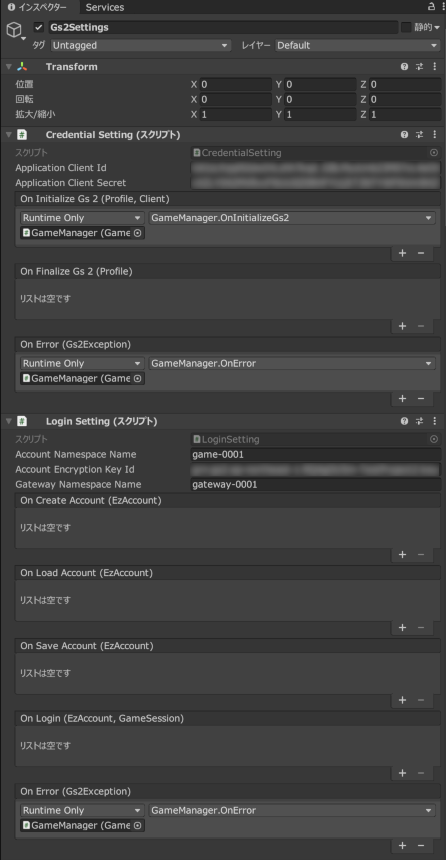
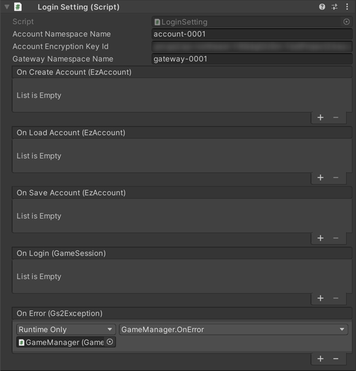
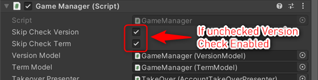
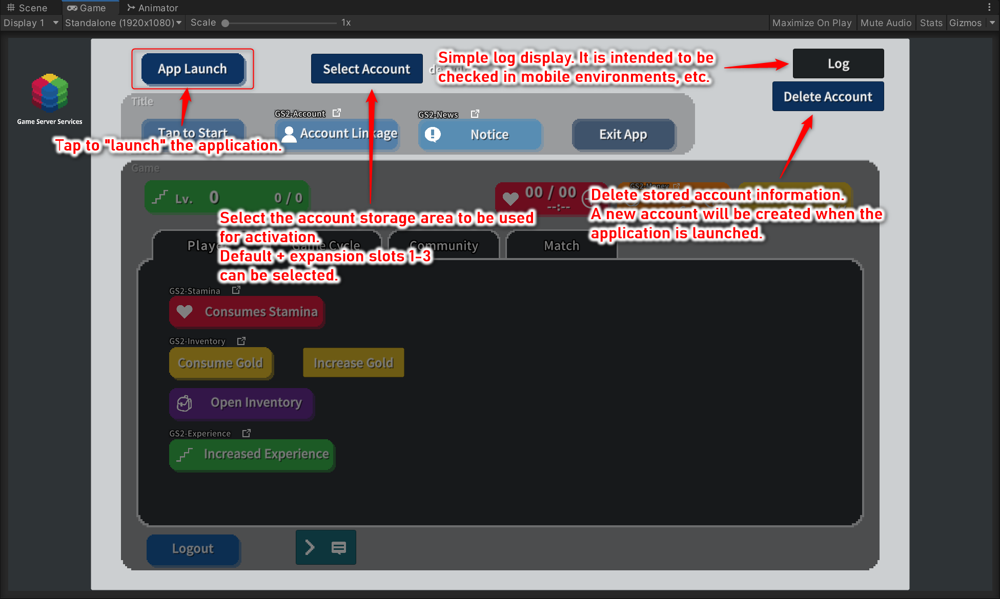
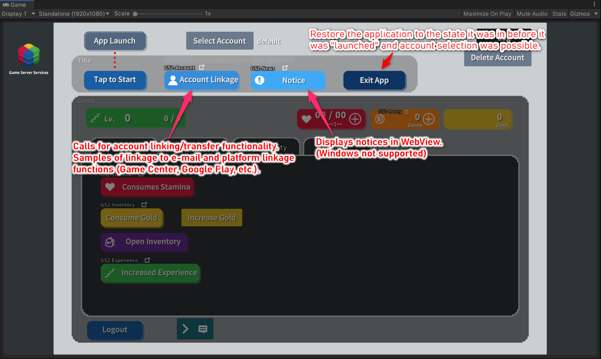
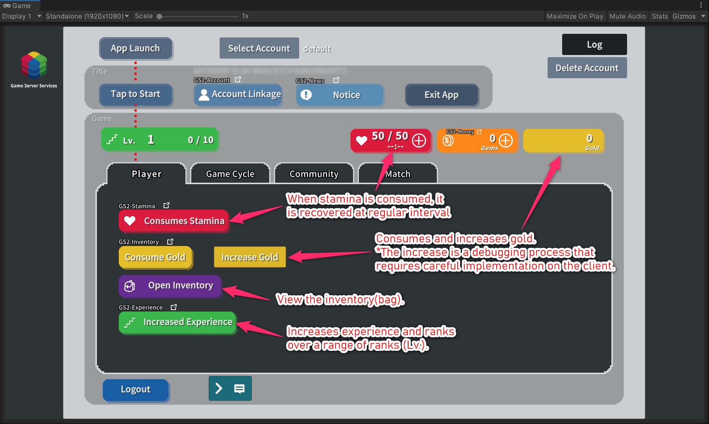
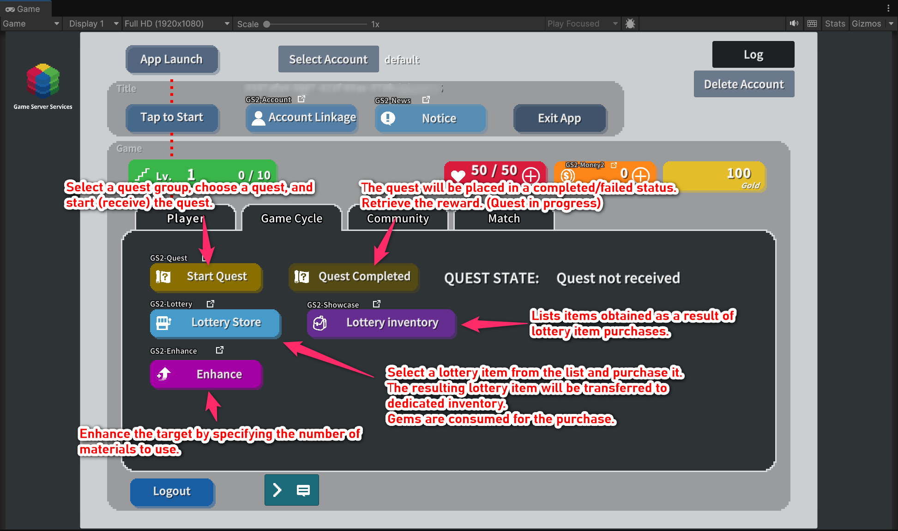
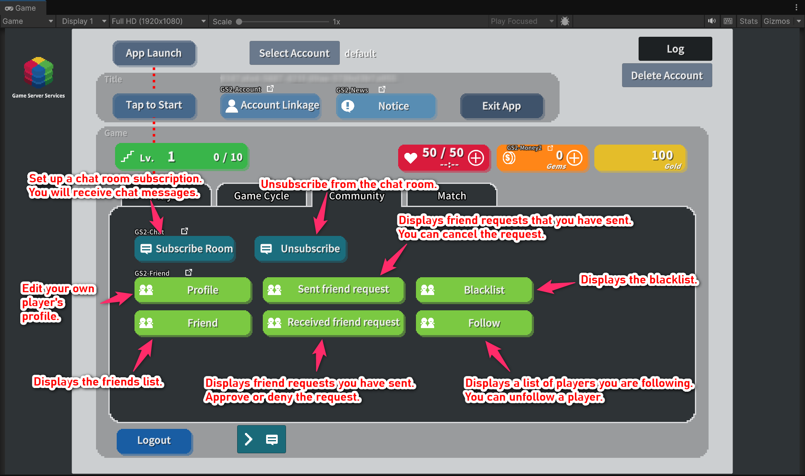
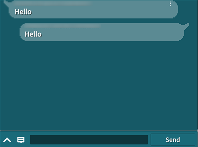
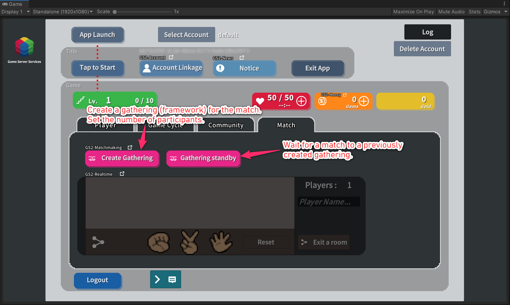

[=> README in Japanese](README-ja.md) / [=> README in Korean](README-ko.md)

# GS2 Sample Project for Unity

This is a sample project for Game Server Services (https://gs2.io) for Unity.  
This is a sample implementation using various GS2 functions for a rough flow in a game.

## Operating Environment

Unity 2022.3.41f1 LTS  

GS2 C# SDK 2024.8.1  
GS2 SDK for Unity 2024.7.14  

## Notes

- The manifest.json and packages-lock.json files included in the sample contain the  
In addition to the SDK for GS2, it includes a description of the packages required to run on Unity 2022.3.  
If you open the project with a Unity version other than the above, you will get  
An error may occur and the package version may need to be changed.  
In that case, you can install the verified version in the package manager to make it work.  

- The Japanese font for TextMeshPro has been changed to  
 Noto Sans Japanese" (https://fonts.google.com/noto/specimen/Noto+Sans+JP)  
is used.  
Licensed under SIL Open Font License 1.1 ( http://scripts.sil.org/OFL )  

## Explanation by function

How to operate each function independently and details of each function are explained individually in the following pages.

- [Creating and logging in to an account (GS2-Account / GS2-Auth / GS2-Gateway)](Docs/Login_en.md)
- [Version Check (GS2-Version)](Docs/Version_en.md)
- [Account Takeover (GS2-Account)](Docs/Takeover_en.md)
- [Notices (GS2-News)](Docs/News_en.md)
- [Stamina/Stamina Store (GS2-Stamina)](Docs/Stamina_en.md)
- [Billing Currency / Billing Currency Store (GS2-Money2 / GS2-Showcase)](Docs/Money_en.md)
- [Gold/Inventory (GS2-Inventory)](Docs/Inventory_en.md)
- [Experience (GS2-Experience)](Docs/Experience_en.md)
- [Quests (GS2-Quest)](Docs/Quest_en.md)
- [Lottery Function (GS2-Lottery)](Docs/Lottery_en.md)
- [Dictionary (GS2-Dictionary)](Docs/Dictionary_en.md)
- [Enhancement (GS2-Enhance)](Docs/Enhance_en.md)
- [Chat (GS2-Chat)](Docs/Chat_en.md)
- [Friend (GS2-Friend)](Docs/Friend_en.md)
- [Matchmaking (GS2-Matchmaking)](Docs/Matchmaking_en.md)
- [Real-Time Game (GS2-Realtime)](Docs/Realtime_en.md)

## Prepare to start

This section deals with the preparations before playing the game on the Unity Editor with the Play button.

### Open the project in Unity

Open `gs2io/gs2-sample-project` as a project in Unity.  
The Unity Package Manager will download the packages needed to resolve dependencies.  
GS2 SDK for Unity and GS2 C# SDK will be downloaded and installed.

TextMeshPro is used for drawing Text.  
The TMP Essential Resources ship with Unity and cannot be redistributed, so they are not part of
this repository. They are imported automatically when the project is opened, which is done once
the following lines appear in the Console:

```
[GS2 Sample] Importing the TMP Essential Resources...
[GS2 Sample] Registered NotoSansKR-Medium SDF in the Fallback Font Assets of TMP Settings.
```

If they are not imported automatically, run
`Window > TextMeshPro > Import TMP Essential Resources`. Opening the scene without them makes
TextMeshPro throw NullReferenceExceptions and no text is displayed.

Open the `Assets/Scenes/SampleGameScene.unity` scene.

### Setting up the Korean font

A Japanese font asset does not contain Hangul glyphs, so displaying Korean
requires the font fallback of TextMeshPro to be configured.  
This is done automatically as well, right after the TMP Essential Resources above are imported:
`Assets/Editor/Gs2SampleKoreanFontSetup.cs` registers
`Assets/Resources/Fonts/NotoSansKR-Medium SDF` in __Fallback Font Assets__.

If it is not configured automatically, do either of the following.

- Run `GS2 Sample > Setup Korean Font Fallback` from the menu
- Open `Edit > Project Settings > TextMesh Pro > Settings` and add  
  `Assets/Resources/Fonts/NotoSansKR-Medium SDF` to __Fallback Font Assets__

Without this, Hangul is not rendered when the language is switched to Korean.  
It does not matter if you only try the sample in Japanese or English.

### Initialize using GS2-Deploy

Use the Deploy function in the [Management Console](https://app.gs2.io/) to create a stack, and  
Prepare the resources necessary for the sample to work.

Create a stack with the following files in the Templates folder.  
The templates are grouped by the __four tabs__ at the bottom of the screen, plus the
features that do not belong to a tab.  
Create them __in order from the top__, because a later template refers to namespaces
created by an earlier one.  

| # | Template file | Function to be set up | Tab | Depends on |
---|---|---|---|---
1 | [initialize_core_template.yaml](Templates/initialize_core_template.yaml) | Login / account linkage and transfer, billing currency and its store | none (status bar) | ― (required)
2 | [initialize_player_template.yaml](Templates/initialize_player_template.yaml) | Stamina and stamina store, gold, inventory, experience, dictionary | Player | 1
3 | [initialize_gamecycle_template.yaml](Templates/initialize_gamecycle_template.yaml) | Quest, lottery (including the inventory for lottery items), enhancement | Game Cycle | 1, 2
4 | [initialize_community_template.yaml](Templates/initialize_community_template.yaml) | Chat, friend | Community | 1
5 | [initialize_match_template.yaml](Templates/initialize_match_template.yaml) | Matchmaking / realtime competition | Match | 1
6 | [initialize_option_template.yaml](Templates/initialize_option_template.yaml) | News, application version and terms of use check (create it if you use them) | none | 1

Template 1, initialize_core_template.yaml, is required.  
For 2 to 6 you may create only the stacks of the features you use, but always create
the stacks they depend on first.  

*If you have already created stacks with an earlier version of this sample (which was
split into 16 per-feature templates), __delete all of the old stacks first.__  
The namespace names are unchanged, so leaving the old stacks in place makes the
creation of the same-named resources fail.  
(No change is needed to the `Gs2Settings` values on the Unity side.)  

```
core ─┬─ player ─── gamecycle
      ├─ community
      ├─ match
      └─ option
```

There are three references that cross template boundaries.  

| Referring template | Referenced resource |
---|---
player | The stamina store consumes the billing currency `money2-0001` (core)
gamecycle | Quests consume stamina `stamina-0001` and their rewards add experience `experience-0001` (player)
gamecycle | Quest rewards and the lottery price use the billing currency `money2-0001` (core)

*The following resources are created automatically as a stack named `Default`  
when the project is created, so there is no need to create them with a template.  

| Automatically created resource | Purpose |
---|---
GS2-Identifier user `default` and its client ID / secret | Credential used to access GS2
GS2-Key namespace `default` and key `default` | Used to calculate signatures
GS2-Gateway namespace `default` | Used to receive notifications (chat / friend / matchmaking, and the completion of automatic execution)
GS2-Distributor namespace `default` | Used for automatic execution of stamp sheets and transactions
GS2-JobQueue namespace `default` | Used for automatic execution of jobs (created with auto run enabled)

If you wait a while and all stacks are in `Create Complete`, the server side configuration is complete.

### Enabling and importing Unity IAP

To purchase on a real device (AppStore / GooglePlay), Unity IAP must be enabled.  

[Install Unity IAP]( https://docs.unity.com/en-us/iap/get-started )  

Enable In-App Purchasing in the Services window, and  
Import the IAP package.  
(Since this sample also works with fake receipts, you can verify the purchase flow even with IAP disabled.)  

### Settings

Select the `Gs2Settings` object in the Hierarchy window.

In the inspector window, register the information of the resource created by GS2-Deploy.  
Fill in the following __bolded__ fields, which are blank when downloaded  
Copy and paste the necessary information from the "output" of each stack.



| Script File | Setting Name | Description                                                             |
-----------------|------|-------------------------------------------------------------------------
| __CredentialSetting__ | __Application Client Id__ | __Credential to access GS2 (Client ID)__                                |
| __CredentialSetting__ | __Application Client Secret__ | __Credential to access GS2 (Client Secret)__                            |
| CredentialSetting | distributorNamespaceName | Namespace name of the GS2-Distributor that will process the transaction |

*From the Output List tab of the __Default__ stack, which is created automatically when the project is created,  
Paste the value printed on the right side of the Output Name __ApplicationClientId__ field to __Application Client Id__.  
Paste the value printed on the right side of the Output Name __ApplicationClientSecret__ field to __Application Client Secret__.  



| Script file | Configuration name | Description |
-----------------|------|------
| LoginSetting | Account Namespace Name        | Namespace name of GS2-Account |
| __LoginSetting__ | __Account Encryption Key Id__ | __The encryption key GRN of the GS2-Key used to encrypt account information in GS2-Account__ |
| LoginSetting | Gateway Namespace Name        | Namespace name of GS2-Gateway (uses the automatically created `default`) |

*From the Output List tab of the stack created by the __initialize_core_template.yaml__ template,  
Paste the value printed on the right side of the Output Name __AccountEncryptionKeyId__ field into the __Account Encryption Key Id__.

### Enable version check functionality

By default, the app version check and Terms of Use check functions are disabled after "app launch".
To enable it, uncheck each of the following in the GameManager → GameManager component of the hierarchy



Once configured, you are ready to launch on Unity.

## Switching the language

This sample supports Japanese (`ja`), English (`en`) and Korean (`ko`).

### Detection at startup

When __Auto Detect Language__ of the `UIManager` component is enabled, the language is detected in `Awake`.

1. If a preference is saved in `PlayerPrefs` (key `Gs2.Sample.Language`), it is used
2. Otherwise the device setting (`Application.systemLanguage`) decides it  
   Japanese becomes `ja`, Korean becomes `ko`, and __everything else becomes `en`__

To pin a specific language in the Editor, uncheck __Auto Detect Language__ and switch __Lang__
of the `UIManager`. While it stays checked, the value is overwritten in `Awake`.

### Switching at runtime

Call `UIManager.SetLanguage()`. Every visible `LocalizedText` updates itself through the
`OnLanguageChanged` event, so there is no need to reopen the screen.

```c#
UIManager.Instance.SetLanguage(UIManager.Language.en);

// To switch temporarily without saving the preference
UIManager.Instance.SetLanguage(UIManager.Language.en, save: false);
```

When the second argument is omitted the preference is saved to `PlayerPrefs` and the same language
is used on the next launch. Note that the sample does not provide a UI to switch the language.

### Defining the texts

The texts are defined per language as a flat `{ "key": "text" }` JSON.

```
Assets/Resources/Localization/ja.json
Assets/Resources/Localization/en.json
Assets/Resources/Localization/ko.json
```

Attach the `LocalizedText` component to a static text in a scene or a prefab and set the JSON key
as its __Key__. To read a text from a script, use `UIManager.Instance.GetLocalizationText(key)`.
Word order differs per language, so use placeholders instead of string concatenation.

```c#
// ja.json : "UnitObtain": "{0} x {1} を入手しました。"
// en.json : "UnitObtain": "Obtained {0} x {1}."
UIManager.Instance.GetLocalizationText("UnitObtain", itemName, count);
```

When the key has no text, the text of the fallback language (`ja`) is used, and when that is missing
as well __the key itself__ is displayed. That is why a string that is not registered in the JSON
shows up as-is.

### Adding a language

1. Add the language code to the `UIManager.Language` enum
2. Add `Assets/Resources/Localization/{language code}.json`

The table is loaded from `Assets/Resources/Localization`, so no other code has to be changed.

### Fonts

A Japanese font asset does not contain Hangul glyphs, so Korean needs the glyphs to be complemented.
This sample covers them with the __Fallback Font Assets__ of TextMeshPro, and __Apply Locale Font__
of `LocalizedText` is disabled by default.

Swapping the font asset itself would reset material presets such as the outline. When the glyphs of
the Chinese characters differ per language (Chinese, for example), register the language and the font
in __Locale Fonts__ of the `UIManager` and enable __Apply Locale Font__.

## Sample flow



When the sample is launched, the `App Launch` button will be enabled.  
Tapping `Appli Launch` will initialize the GS2 SDK (GS2-Identifier), the  
If enabled, the app version check, user confirmation of terms of use, and  
(GS2-Version), and
Performs login with an account.  
When launched for the first time, an anonymous account is automatically created.  
(GS2-Account)  

[=> Account creation and login Explanation](Docs/Login_en.md)  
[=> Version check Explanation](Docs/Version_en.md)  



After login is completed, the user is taken to the title screen.  
You can invoke the `account linking` function.  
You can add an email address or  
Game Center/Google Play Game Service accounts available on each platform and  
The following is a sample of the functionality that enables a transfer to be performed.
(GS2-Account)
Open WebView with `Notices`. Display the contents of the notice.  
(GS2-News)

[=> Account takeover explanation](Docs/Takeover_en.md)  
[=> News Go to explanation](Docs/News_en.md)

Tap `Tap to Start` to go into the game.  
You can access the Player, Game Cycle, Community, and Competitive tabs.


The __level and experience__ are displayed in the upper left corner.  
(GS2-Experience)


The __Stamina__, __Currency Charged__, and __Gold__ are displayed in the upper right corner.  
(GS2-Stamina, GS2-Money2, GS2-Inventory)

## Player Tab



`Stamina consumption` - Stamina is reduced and recovered in a certain time.
(GS2-Stamina)

[=> Stamina/Stamina Store Explanation](Docs/Stamina_en.md)

`Gold consumption` - Decreases gold by 10.  
`Gold increase` - Gold is increased by 100.  
(GS2-Inventory)

`Open Inventory` - List items. Tap an item to spend it.  
`Get FireElement`, `Get WaterElement` - Increases items by 5 each.  
(GS2-Inventory)

[=> Gold/Inventory Explanation](Docs/Inventory_en.md)

Increases experience - Increases experience by 10.

[=> Experience Explanation](Docs/Experience_en.md)
 
## Game Cycle Tab



`Start Quest ` - Starts a quest.  
`Quest Completed` - Completes or fails (discards) a quest.  
(GS2-Quest)  

[=> Quest Explanation](Docs/Quest_en.md)

`Lottery Store` - Select an item from the list of lottery items and purchase the item.  
After the lottery, the item is obtained. Items are transferred to your dedicated inventory.  
(GS2-Lottery, GS2-Inventory, GS2-Showcase, Transaction)  
Open `Lottery Inventory` - Lists items acquired through the lottery.  
Tap an item to consume it.  
(GS2-Inventory)

[⇒Lottery Function Explanation](Docs/Lottery_en.md)

## Community tab



`Subscribe room` - Subscribe to a chat room so that you can receive notifications of new messages posted to the room.  
`Unsubscribe` - Unsubscribe from a chat room.
(GS2-Chat)

`Profile` - Edit your player's profile.  
`Friends` - Displays a list of friends.  
`Request in Progress` - Displays a list of friend requests that are being sent from the player to other players.  
`Friend request being recieved` - Displays a list of friend requests sent from other players to the player.    
`Blacklist` - Displays the blacklist.  
`Follow` - Displays a list of players you are following.  
(GS2-Friend)

Press `>` at the bottom center of the screen to open the chat window.



Messages can be sent and received to and from the room with the name set in roomName in ChatSetting.

## Matching tab



Create Gathering -- Create a gathering (unit of matching) by setting the number of participants.  
Waiting for `gathering` - It requests participation in a gathering.  
(GS2-Matchmaking)  

[=> Matchmaking Explanation](Docs/Matchmaking_en.md)

If the match is successful, the room is entered using GS2-Realtime and  
Participants can communicate with each other.  
In the sample, a simple game of rock-paper-scissors can be played.  
(GS2-Realtime)  

[=> Realtime Explanation](Docs/Realtime_en.md)

## Store


Stamina Store (+ button on stamina display) ...  
This is a sample of purchasing products that work with GS2-Exchange to spend GS2-Money2 to restore stamina values.  
(GS2-Stamina, GS2-Exchange, GS2-Money2)  

[=> Stamina/Stamina Store Explanation](Docs/Stamina_en.md)
 
Billing Currency Store (+ button in billing currency display) ...  
This is a sample of selling billable currency managed using GS2-Money2 in GS2-Showcase.  
One of the defined products has a limit on the number of purchases by GS2-Limit, and can be purchased only once.  
(GS2-Showcase, GS2-Limit, GS2-Money2)  

[=> Billing Currency Store Explanation](Docs/Money_en.md)