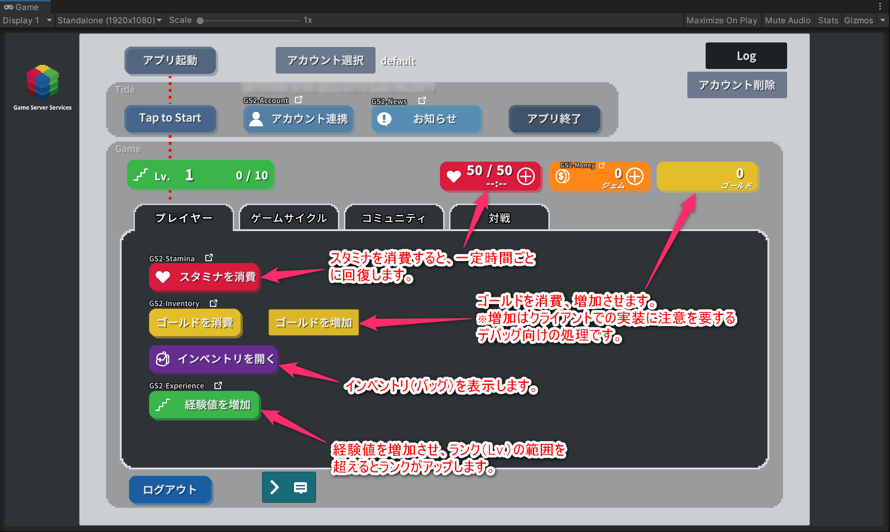

# GS2 Sample Project for Unity

Game Server Services (https://gs2.io) の Unity 向けのサンプルプロジェクトです。  
ゲームでの大まかな流れ（起動→アウトゲーム→インゲーム）を想定した、  
GS2の各種機能を使った実装サンプルです。

## 動作環境

Unity 2019.4.33f1

GS2 SDK for Unity　2021.11.6  
GS2 C# SDK　2021.11.3

## 注意事項

・サンプルに含まれるmanifest.json、packages-lock.jsonファイルには、  
GS2のSDKのほか、Unity2019.4上での動作に必要なパッケージの記述が含まれます。  
上記以外のUnityバージョンでプロジェクトを開くと、  
エラーが発生しパッケージのバージョン変更が必要になる場合があります。  
その際は、パッケージマネージャーで検証済みバージョンをインストールすることで  
動作が可能になります。  

・TextMeshPro用の日本語フォントに
 「Noto Sans Japanese」（ https://fonts.google.com/noto/specimen/Noto+Sans+JP ）  
を使用しています。  
Licensed under SIL Open Font License 1.1 ( http://scripts.sil.org/OFL )  

## 起動の準備

ここではUnity Editor上でPlayボタンでゲームを再生するまでの準備について扱います。

### Unity でプロジェクトを開く

Unityで`gs2io/gs2-sample-project` をプロジェクトとして開きます。  
Unity Package Manager により、依存関係の解決に必要なパッケージのダウンロードが行われます。  
GS2 SDK for Unity、GS2 C# SDKのダウンロード、インストールが行われます。

Assets/Scenes/SampleGameScene.unity シーンを開きます。

Textの描画にTextMeshProを使用しています。  
シーンを開いた際に「TMP Importer」ウィンドウが表示されますので  
「Import TMP Essentials」をクリックし、TMP Essentialsのインポートをお願いします。  

### GS2-Deploy を使って初期設定をおこなう

[マネージメントコンソール](https://app.gs2.io/)のDeploy機能を使ってスタックの作成を行い、  
サンプルの動作に必要なリソースの準備を行います。

Templatesフォルダの以下のファイルでスタックを作成します。  

- [initialize_credential_template.yaml - クレデンシャル](Templates/initialize_credential_template.yaml)
- [initialize_account_template.yaml - ログイン/アカウント連携・引継ぎ](Templates/initialize_account_template.yaml)  
- [initialize_stamina_template.yaml - スタミナ](Templates/initialize_stamina_template.yaml)
- [initialize_money_template.yaml - 課金通貨/課金通貨ストア](Templates/initialize_money_template.yaml)
- [initialize_gold_template.yaml - ゴールド](Templates/initialize_gold_template.yaml)
- [initialize_quest_template.yaml - クエスト](Templates/initialize_quest_template.yaml)
- [initialize_realtime_template.yaml - マッチメイキング/リアルタイム対戦](Templates/initialize_realtime_template.yaml)
- [initialize_inventory_template.yaml - インベントリ](Templates/initialize_inventory_template.yaml)
- [initialize_gacha_template.yaml - ガチャ機能](Templates/initialize_gacha_template.yaml)
- [initialize_jobqueue_template.yaml - JobQueue機能設定](Templates/initialize_jobqueue_template.yaml)
- [initialize_unit_template.yaml - ガチャアイテム用インベントリ](Templates/initialize_unit_template.yaml)

※GS2-Version バージョンチェック機能を使うときは作成が必要
- [initialize_version_template.yaml - アプリバージョンチェック](Templates/initialize_version_template.yaml)
- [initialize_term_template.yaml - 利用規約チェック](Templates/initialize_term_template.yaml)

のスタックを作成します。  
しばらく待ってすべてのスタックの状態が `CREATE_COMPLETE` になればサーバ側の設定は完了です。

### Unity IAPの有効化、インポート

GS2-Moneyを使用したサンプルの動作には、Unity IAPの有効化が必要になります。  
( https://docs.unity3d.com/ja/2019.4/Manual/UnityIAPSettingUp.html )  
サービスウィンドウでのIn-App Purchasingの有効化、  
IAP パッケージのインポートを行います。  

### Settings の設定

ヒエラルキーウィンドウで `Gs2Settings`オブジェクト を選択します。

インスペクターウィンドウで GS2-Deploy で作成したリソースの情報を登録します。  
各スタックの「アウトプット」より必要な情報をコピー・アンド・ペーストします。

| スクリプトファイル | 設定名 | 説明 |
-----------------|------|------
| CredentialSetting | Application Client Id | GS2 にアクセスするためのクレデンシャル（クライアントID） |
| CredentialSetting | Application Client Secret | GS2 にアクセスするためのクレデンシャル（クライアントシークレット） |
| LoginSetting | accountNamespaceName | GS2-Account のネームスペース名 |
| LoginSetting | accountEncryptionKeyId | GS2-Account でアカウント情報の暗号化に使用する GS2-Key の暗号鍵GRN |
| LoginSetting | gatewayNamespaceName | GS2-Gateway のネームスペース名 |
| StaminaSetting | staminaNamespaceName | GS2-Stamina のネームスペース名 |
| StaminaSetting | staminaModelName | GS2-Stamina のスタミナのモデル名 |
| StaminaSetting | staminaName | GS2-Stamina のスタミナ名 |
| StaminaSetting | exchangeNamespaceName | スタミナの回復に使用する GS2-Exchange のネームスペース名 |
| StaminaSetting | exchangeRateName | スタミナの回復に使用する GS2-Exchange の交換レート名 |
| StaminaSetting | exchangeKeyId | GS2-Exchange で交換処理に発行するスタンプシートの署名計算に使用する暗号鍵 |
| StaminaSetting | distributorNamespaceName | 交換したスタミナ回復処理を配送する GS2-Distributor のネームスペース名 |
| MoneySetting | moneyNamespaceName | GS2-Money のネームスペース名 |
| MoneySetting | showcaseNamespaceName | GS2-Showcase のネームスペース名 |
| MoneySetting | showcaseName | GS2-Showcase の陳列棚名 |
| MoneySetting | showcaseKeyId | GS2-Showcase で商品購入時に発行するスタンプシートの署名計算に使用する暗号鍵 |
| MoneySetting | limitNamespaceName | 購入回数制限を実現する GS2-Limit のネームスペース名 |
| MoneySetting | distributorNamespaceName | 購入した商品を配送する GS2-Distributor のネームスペース名 |
| GoldSetting | inventoryNamespaceName | GS2-Inventory のゴールドのネームスペース名 |
| GoldSetting | inventoryModelName | GS2-Inventoryのゴールドのモデルのネームスペース名 |
| GoldSetting | itemModelName | アイテムモデルの名前 |
| GoldSetting | identifierAcquireGoldClientId | ゴールドの増加が可能な権限のクライアントID |
| GoldSetting | identifierAcquireGoldClientSecret | ゴールドの増加が可能な権限のクライアントシークレット |
| QuestSetting | questNamespaceName | GS2-Quest のネームスペース名 |
| QuestSetting | questKeyId | GS2-Quest で報酬の付与処理に発行するスタンプシートの署名計算に使用する暗号鍵 |
| QuestSetting | distributorNamespaceName | 報酬を配送する GS2-Distributor のネームスペース名 |
| QuestSetting | queueNamespaceName | 報酬の付与に使用するGS2-JobQueue のネームスペース名 |
| MatchmakingSetting | matchmakingNamespaceName | GS2-Matchmaking のネームスペース名 |
| RealtimeSetting | realtimeNamespaceName | GS2-Realtime のネームスペース名 |
| InventorySetting | inventoryNamespaceName | GS2-Inventory のインベントリのネームスペース名 |
| InventorySetting | inventoryModelName | GS2-Inventoryのインベントリのモデルのネームスペース名 |
| InventorySetting | identifierAcquireItemClientId | アイテムの増加が可能な権限のクライアントID |
| InventorySetting | identifierAcquireItemClientSecret | アイテムの増加が可能な権限のクライアントシークレット |
| VersionSetting | versionNamespaceName | GS2-Version のアプリバージョンチェックのネームスペース名 |
| VersionSetting | versionName | GS2-Version のアプリバージョンチェックのバージョン名 |
| VersionSetting | currentVersionMajor | アプリの現在のバージョン番号　メジャー部分 |
| VersionSetting | currentVersionMinor | アプリの現在のバージョン番号　マイナー部分 |
| VersionSetting | currentVersionMicro | アプリの現在のバージョン番号　マイクロ部分 |
| TermSetting | versionNamespaceName | GS2-Version の利用規約チェックのネームスペース名 |
| TermSetting | versionName | GS2-Version の利用規約チェックのバージョン名 |
| GachaSetting | lotteryNamespaceName | GS2-Lottery のネームスペース名 |
| GachaSetting | jobqueueNamespaceName | GS2-JobQueue のネームスペース名 |
| GachaSetting | showcaseNamespaceName | GS2-Showcase のネームスペース名 |
| GachaSetting | showcaseName | GS2-Showcase の陳列棚名 |
| GachaSetting | showcaseKeyId | GS2-Showcase で商品購入時に発行するスタンプシートの署名計算に使用する暗号鍵 |
| GachaSetting | lotteryKeyId | GS2-Lottery で商品購入時に発行するスタンプシートの署名計算に使用する暗号鍵 |
| UnitSetting | inventoryNamespaceName | GS2-Inventory のガチャアイテム専用インベントリのネームスペース名 |
| UnitSetting | inventoryModelName | GS2-Inventoryのガチャアイテム専用インベントリのモデルのネームスペース名 |
| UnitSetting | identifierAcquireUnitClientId | アイテムの増加が可能な権限のクライアントID |
| UnitSetting | identifierAcquireUnitClientSecret | アイテムの増加が可能な権限のクライアントシークレット |
| JobQueueSetting | jobQueueNamespaceName | GS2-JobQueue のネームスペース名 |

### バージョンチェック機能の有効化

デフォルトでは「アプリ起動」後にアプリバージョンチェック、利用規約のチェック機能は無効化されています。
有効にするには、ヒエラルキーのGameManager → GameManagerコンポーネントの以下のチェックをそれぞれ外します。

設定が完了したら、Unity上での起動の準備は完了です。

## サンプルの流れ

サンプルを起動すると　アプリ起動　のボタンが有効になります。  
アプリ起動をタップすると、GS2 SDKの初期化（GS2-Identifier）、  
有効化されていればアプリのバージョンチェック、利用規約のユーザー確認、  
（GS2-Version）  
アカウントによるログインを実行します。  
初回起動時は匿名アカウントの自動作成を行います。  
（GS2-Account）  

ログイン完了後、タイトル画面に遷移します。「アカウント連携」機能を呼び出すことができます。
作成ずみの匿名アカウントにメールアドレスや、 各プラットフォームで利用可能な
Game Center/Google Play Game Service のアカウントを連携し、
引継ぎを実行できるようにする機能サンプルです。
（GS2-Account）

　Tap to Start　をタップするとゲーム内に遷移します。
「プレイヤー」「ゲームサイクル」「対戦」の各タブにアクセスが可能です。

右上にスタミナ、課金通貨、ゴールドが表示されます。
（GS2-Stamina、GS2-Money、GS2-Inventory）

## プレイヤータブ

スタミナ消費　…　スタミナを減少し、一定時間で回復します。
（GS2-Stamina）

ゴールド消費　…　ゴールドを10減少させます。  
ゴールド増加　…　ゴールドを100増加させます。  
（GS2-Inventory）

インベントリを開く　…　アイテムを一覧表示します。アイテムをタップで消費（つかう）します。  
　FireElement入手、WaterElement入手　…　アイテムをそれぞれ5増加させます。  
（GS2-Inventory）

## ゲームサイクルタブ

クエスト開始　…　クエストグループを選択、クエストを開始します。  
クエスト完了　…　クエストを完了、もしくは失敗（破棄）します。  
（GS2-Quest）  

ガチャをまわす　…　ガチャ商品を選択、ガチャを回します。抽選後、アイテムを入手します。  
アイテムは専用のインベントリに振り込まれます。
（GS2-Lottery、GS2-Inventory、GS2-JobQueue、スタンプシート）

## 対戦タブ

ギャザリング作成　…　参加人数を設定してギャザリング（マッチングの単位）を作成します。  
ギャザリング待機　…　ギャザリングへの参加をリクエストします。  
（GS2-Matchmaking）  

マッチングに成功すると、GS2-Realtimeを使用したRoomへの入室が行われ、  
参加者同士での通信が可能になります。  
サンプルでは簡単なじゃんけん対戦を行えます。  
(GS2-Realtime)  

## ステータス

スタミナストア　（スタミナ表示の＋ボタン）…  
GS2-Exchange と連携して GS2-Money を消費してスタミナ値を回復する商品の購入のサンプルです。  
（GS2-Stamina、GS2-Exchange、Gs2-Money）  

課金通貨ストア　（課金通貨表示の＋ボタン）…  
GS2-Money を使って管理されている課金通貨を、GS2-Showcase で販売するサンプルです。  
定義されている商品の１つに GS2-Limit による購入回数の制限があり、１回のみ購入が可能になっています。  
（GS2-Showcase、GS2-Limit、GS2-Money）  

# Settings 設定の詳細
[Settings 設定](Settings.md)