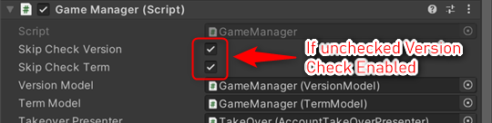
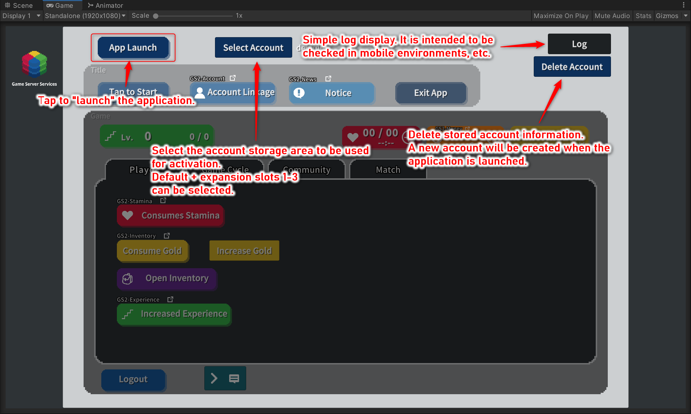
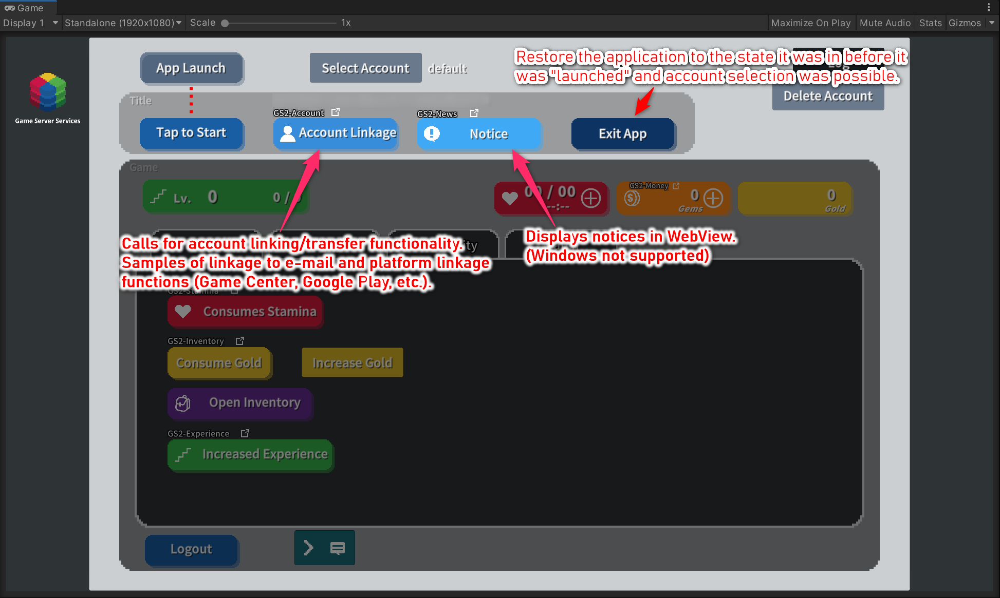
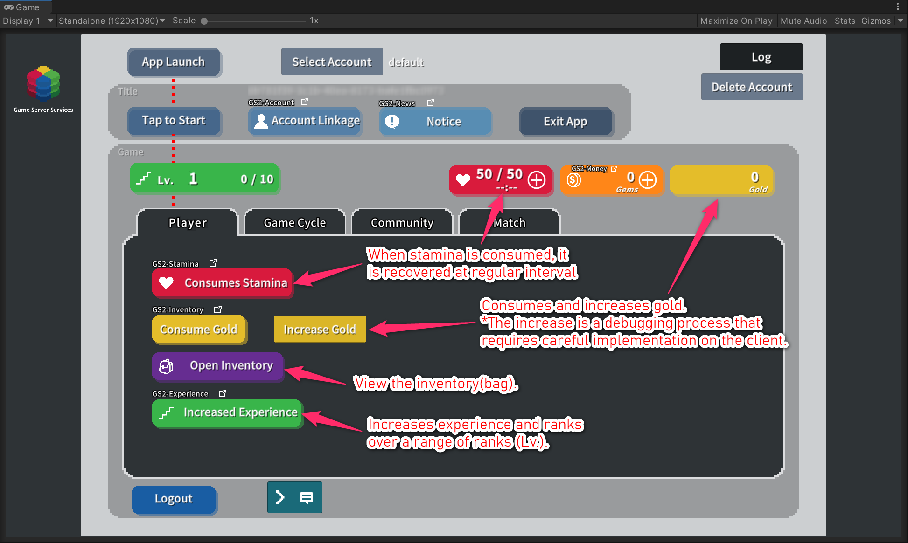
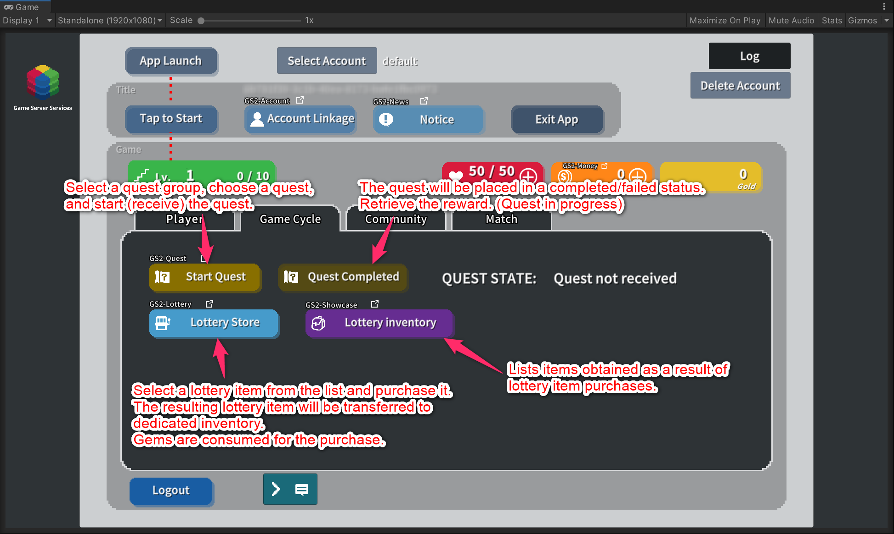
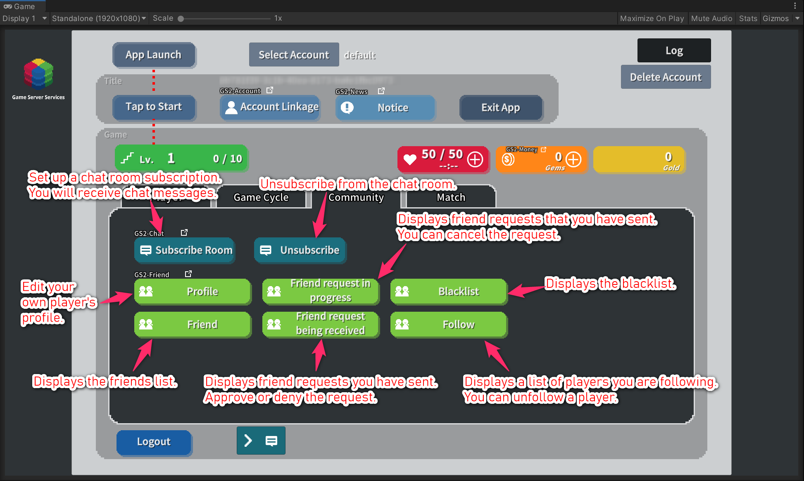
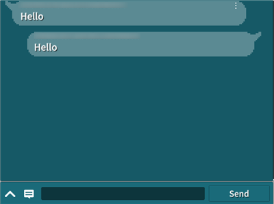
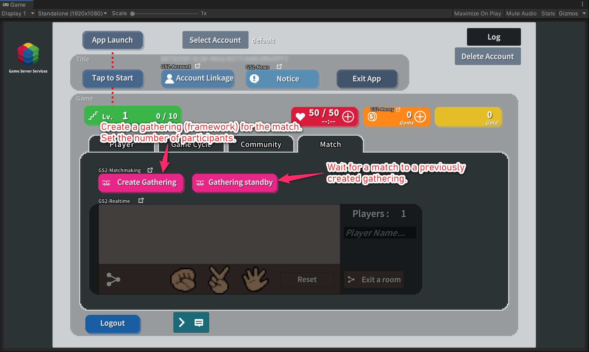

[=> README in Japanese](README-ja.md)

# GS2 Sample Project for Unity

This is a sample project for Game Server Services (https://gs2.io) for Unity.  
This is a sample implementation using various GS2 functions for a rough flow in a game.

## Operating Environment

Unity 2020.3.48f1 LTS  

GS2 C# SDK 2023.8.18  
GS2 SDK for Unity 2023.8.19  

## Notes

- The manifest.json and packages-lock.json files included in the sample contain the  
In addition to the SDK for GS2, it includes a description of the packages required to run on Unity 2020.3.  
If you open the project with a Unity version other than the above, you will get  
An error may occur and the package version may need to be changed.  
In that case, you can install the verified version in the package manager to make it work.  

- The Japanese font for TextMeshPro has been changed to  
 Noto Sans Japanese" (https://fonts.google.com/noto/specimen/Noto+Sans+JP)  
is used.  
Licensed under SIL Open Font License 1.1 ( http://scripts.sil.org/OFL )  

## Explanation by function

How to operate each function independently and details of each function are explained individually in the following pages.

- [Creating and logging in to an account (GS2-Account / GS2-Auth / GS2-Gateway)](Docs/Login_en.md)
- [Version Check (GS2-Version)](Docs/Version_en.md)
- [Account Takeover (GS2-Account)](Docs/Takeover_en.md)
- [Notices (GS2-News)](Docs/News_en.md)
- [Stamina/Stamina Store (GS2-Stamina)](Docs/Stamina_en.md)
- [Billing Currency / Billing Currency Store (GS2-Money / GS2-Showcase)](Docs/Money_en.md)
- [Gold/Inventory (GS2-Inventory)](Docs/Inventory_en.md)
- [Experience (GS2-Experience)](Docs/Experience_en.md)
- [Quests (GS2-Quest)](Docs/Quest_en.md)
- [Lottery Function (GS2-Lottery)](Docs/Lottery_en.md)
- [Chat (GS2-Chat)](Docs/Chat_en.md)
- [Friend (GS2-Friend)](Docs/Friend_en.md)
- [Matchmaking (GS2-Matchmaking)](Docs/Matchmaking_en.md)
- [Real-Time Game (GS2-Realtime)](Docs/Realtime_en.md)

## Prepare to start

This section deals with the preparations before playing the game on the Unity Editor with the Play button.

### Open the project in Unity

Open `gs2io/gs2-sample-project` as a project in Unity.  
The Unity Package Manager will download the packages needed to resolve dependencies.  
GS2 SDK for Unity and GS2 C# SDK will be downloaded and installed.

Open the `Assets/Scenes/SampleGameScene_en.unity` scene.

TextMeshPro is used for drawing Text.  
When the scene is opened, the "TMP Importer" window will appear.  
Please click "Import TMP Essentials" to import TMP Essentials.  

### Initialize using GS2-Deploy

Use the Deploy function in the [Management Console](https://app.gs2.io/) to create a stack, and  
Prepare the resources necessary for the sample to work.

Create a stack with the following files in the Templates folder  

#### Required Templates

| Template file | Function to be set up |
---|---
[initialize_credential_template.yaml](Templates/initialize_credential_template.yaml) | initialize credential GS2
[initialize_account_template.yaml](Templates/initialize_account_template.yaml) |login/account linkage and transfer
[initialize_distributor_template.yaml](Templates/initialize_distributor_template.yaml) |GS2-Distributor　GS2-JobQueue setting

#### Template required for each function to work

| Template file | Function to be set up |
---|---
[initialize_stamina_template.yaml](Templates/initialize_stamina_template.yaml) |Stamina/Stamina Store
[initialize_money_template.yaml](Templates/initialize_money_template.yaml) | billing currency/ billing currency store
[initialize_gold_template.yaml](Templates/initialize_gold_template.yaml) | gold
[initialize_inventory_template.yaml](Templates/initialize_inventory_template.yaml) | inventory
[initialize_experience_template.yaml](Templates/initialize_experience_template.yaml) | Experience

| Template file | Function to be set |
---|---
[initialize_quest_template.yaml](Templates/initialize_quest_template.yaml) | Quest
[initialize_lottery_template.yaml](Templates/initialize_lottery_template.yaml) | Lottery
[initialize_unit_template.yaml](Templates/initialize_unit_template.yaml) | Inventory for lottery items *Necessary for the operation of the lottery function

| Template file | Function to be set |
---|---
[initialize_chat_template.yaml](Templates/initialize_chat_template.yaml) | Chat
[initialize_friend_template.yaml](Templates/initialize_friend_template.yaml) | Friend function

| Template files | Functions to set up |
---|---
[initialize_realtime_template.yaml](Templates/initialize_realtime_template.yaml) | matchmaking/realtime competition

| Template file | Function to be set | |
---|---|---
[initialize_news_template.yaml](Templates/initialize_news_template.yaml) | News | Created when using the GS2-News notification function.

| Template file | Function to be set up | |
---|---|---
[initialize_version_template.yaml](Templates/initialize_version_template.yaml) | Check app version and terms of use | Created when using the GS2-Version version check function

If you wait a while and all stacks are in `CREATE_COMPLETE`, the server side configuration is complete.

### Enabling and importing Unity IAP

Unity IAP must be enabled for the sample to work with GS2-Money.  
( https://docs.unity3d.com/ja/2020.3/Manual/UnityIAPSettingUp.html )  
Enable In-App Purchasing in the Services window, and  
Import the IAP package.  

### Settings

Select the `Gs2Settings` object in the Hierarchy window.

In the inspector window, register the information of the resource created by GS2-Deploy.  
Fill in the following __bolded__ fields, which are blank when downloaded  
Copy and paste the necessary information from the "output" of each stack.

| Script File | Setting Name | Description |
-----------------|------|------
| __CredentialSetting__ | __Application Client Id__ | __Credential to access GS2 (Client ID)__ |
| __CredentialSetting__ | __Application Client Secret__ | __Credential to access GS2 (Client Secret)__ |
| CredentialSetting | distributorNamespaceName | Namespace name of the GS2-Distributor that will process the stamp sheet |

*From the Output List tab of the stack created by the initialize_credential_template.yaml template,  
Paste the value printed on the right side of the Output Name __ApplicationClientId__ field to __Application Client Id__.  
Paste the value printed on the right side of the Output Name __ApplicationClientSecret__ field to __Application Client Secret__.  

| Script file | Configuration name | Description |
-----------------|------|------
| LoginSetting | Account Namespace Name        | Namespace name of GS2-Account |
| __LoginSetting__ | __Account Encryption Key Id__ | __The encryption key GRN of the GS2-Key used to encrypt account information in GS2-Account__ |
| LoginSetting | Gateway Namespace Name        | Namespace name of GS2-Gateway |

*From the Output List tab of the stack created by the __initialize_account_template.yaml__ template,  
Paste the value printed on the right side of the Output Name __AccountEncryptionKeyId__ field into the __Account Encryption Key Id__.

### Enable version check functionality

By default, the app version check and Terms of Use check functions are disabled after "app launch".
To enable it, uncheck each of the following in the GameManager → GameManager component of the hierarchy

Once configured, you are ready to launch on Unity.

## Sample flow

When the sample is launched, the `App Launch` button will be enabled.  
Tapping `Appli Launch` will initialize the GS2 SDK (GS2-Identifier), the  
If enabled, the app version check, user confirmation of terms of use, and  
(GS2-Version), and
Performs login with an account.  
When launched for the first time, an anonymous account is automatically created.  
(GS2-Account)  

[=> Account creation and login Explanation](Docs/Login_en.md)  
[=> Version check Explanation](Docs/Version_en.md)  

After login is completed, the user is taken to the title screen.  
You can invoke the `account linking` function.  
You can add an email address or  
Game Center/Google Play Game Service accounts available on each platform and  
The following is a sample of the functionality that enables a transfer to be performed.
(GS2-Account)
Open WebView with `Notices`. Display the contents of the notice.  
(GS2-News)

[=> Account takeover explanation](Docs/Takeover_en.md)  
[=> News Go to explanation](Docs/News_en.md)

Tap `Tap to Start` to go into the game.  
You can access the Player, Game Cycle, Community, and Competitive tabs.

The __level and experience__ are displayed in the upper left corner.  
(GS2-Experience)

The __Stamina__, __Currency Charged__, and __Gold__ are displayed in the upper right corner.  
(GS2-Stamina, GS2-Money, GS2-Inventory)

## Player Tab

`Stamina consumption` - Stamina is reduced and recovered in a certain time.
(GS2-Stamina)

[=> Stamina/Stamina Store Explanation](Docs/Stamina_en.md)

`Gold consumption` - Decreases gold by 10.  
`Gold increase` - Gold is increased by 100.  
(GS2-Inventory)

`Open Inventory` - List items. Tap an item to spend it.  
`Get FireElement`, `Get WaterElement` - Increases items by 5 each.  
(GS2-Inventory)

[=> Gold/Inventory Explanation](Docs/Inventory_en.md)

Increases experience - Increases experience by 10.

[=> Experience Explanation](Docs/Experience_en.md)
 
## Game Cycle Tab

`Start Quest ` - Starts a quest.  
`Quest Completed` - Completes or fails (discards) a quest.  
(GS2-Quest)  

[=> Quest Explanation](Docs/Quest_en.md)

`Lottery Store` - Select an item from the list of lottery items and purchase the item.  
After the lottery, the item is obtained. Items are transferred to your dedicated inventory.  
(GS2-Lottery, GS2-Inventory, GS2-JobQueue, Stamp Sheet)  
Open `Lottery Inventory` - Lists items acquired through the lottery.  
Tap an item to consume it.  
(GS2-Inventory)

[⇒Lottery Function Explanation](Docs/Lottery_en.md)

## Community tab

`Subscribe room` - Subscribe to a chat room so that you can receive notifications of new messages posted to the room.  
`Unsubscribe` - Unsubscribe from a chat room.
(GS2-Chat)

`Profile` - Edit your player's profile.  
`Friends` - Displays a list of friends.  
`Request in Progress` - Displays a list of friend requests that are being sent from the player to other players.  
`Friend request being recieved` - Displays a list of friend requests sent from other players to the player.    
`Blacklist` - Displays the blacklist.  
`Follow` - Displays a list of players you are following.  
(GS2-Friend)

Press `>` at the bottom center of the screen to open the chat window.

Messages can be sent and received to and from the room with the name set in roomName in ChatSetting.

## Matching tab

Create Gathering -- Create a gathering (unit of matching) by setting the number of participants.  
Waiting for `gathering` - It requests participation in a gathering.  
(GS2-Matchmaking)  

[=> Matchmaking Explanation](Docs/Matchmaking_en.md)

If the match is successful, the room is entered using GS2-Realtime and  
Participants can communicate with each other.  
In the sample, a simple game of rock-paper-scissors can be played.  
(GS2-Realtime)  

[=> Realtime Explanation](Docs/Realtime_en.md)

## Store

Stamina Store (+ button on stamina display) ...  
This is a sample of purchasing products that work with GS2-Exchange to spend GS2-Money to restore stamina values.  
(GS2-Stamina, GS2-Exchange, GS2-Money)  

[=> Stamina/Stamina Store Explanation](Docs/Stamina_en.md)
 
Billing Currency Store (+ button in billing currency display) ...  
This is a sample of selling billable currency managed using GS2-Money in GS2-Showcase.  
One of the defined products has a limit on the number of purchases by GS2-Limit, and can be purchased only once.  
(GS2-Showcase, GS2-Limit, GS2-Money)  

[=> Billing Currency Store Explanation](Docs/Money_en.md)