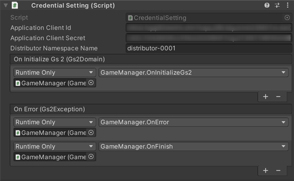
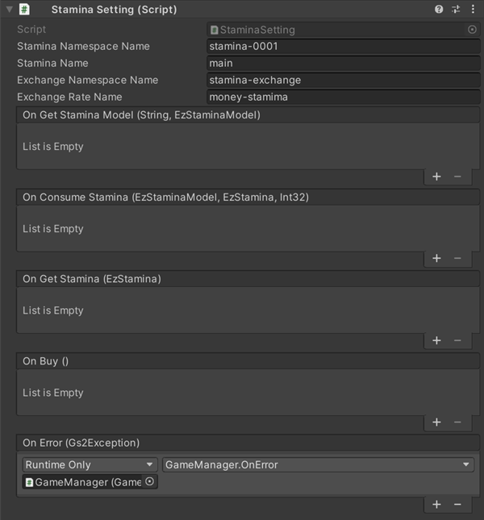

# GS2 Sample Project for Unity

Game Server Services (https://gs2.io) の Unity 向けのサンプルプロジェクトです。  
ゲームでの大まかな流れ（起動→アウトゲーム→インゲーム）を想定した、  
GS2の各種機能を使った実装サンプルです。

## 動作環境

Unity 2019.4.33f1

GS2 SDK for Unity　2021.11.6  
GS2 C# SDK　2021.11.3

## 注意事項

・サンプルに含まれるmanifest.json、packages-lock.jsonファイルには、  
GS2のSDKのほか、Unity2019.4上での動作に必要なパッケージの記述が含まれます。  
上記以外のUnityバージョンでプロジェクトを開くと、  
エラーが発生しパッケージのバージョン変更が必要になる場合があります。  
その際は、パッケージマネージャーで検証済みバージョンをインストールすることで  
動作が可能になります。  

・TextMeshPro用の日本語フォントに
 「Noto Sans Japanese」（ https://fonts.google.com/noto/specimen/Noto+Sans+JP ）  
を使用しています。  
Licensed under SIL Open Font License 1.1 ( http://scripts.sil.org/OFL )  

## 起動の準備

### Unity でプロジェクトを開く

Unityで`gs2io/gs2-sample-project` をプロジェクトとして開きます。  
Unity Package Manager により、依存関係の解決に必要なパッケージのダウンロードが行われます。  
GS2 SDK for Unity、GS2 C# SDKのダウンロード、インストールが行われます。

Assets/Scenes/SampleGameScene.unity シーンを開きます。

Textの描画にTextMeshProを使用しています。  
シーンを開いた際に「TMP Importer」ウィンドウが表示されますので  
「Import TMP Essentials」をクリックし、TMP Essentialsのインポートをお願いします。  

### GS2-Deploy を使って初期設定をおこなう

[マネージメントコンソール](https://app.gs2.io/)のDeploy機能を使ってスタックの作成を行い、  
サンプルの動作に必要なリソースの準備を行います。

Templatesフォルダの以下のファイルでスタックを作成します。  

- [initialize_credential_template.yaml - クレデンシャル](Templates/initialize_credential_template.yaml)
- [initialize_account_template.yaml - ログイン/アカウント連携・引継ぎ](Templates/initialize_account_template.yaml)
- [initialize_stamina_template.yaml - スタミナ](Templates/initialize_stamina_template.yaml)
- [initialize_money_template.yaml - 課金通貨](Templates/initialize_money_template.yaml)
- [initialize_gold_template.yaml - ゴールド](Templates/initialize_gold_template.yaml)
- [initialize_quest_template.yaml - クエスト](Templates/initialize_quest_template.yaml)
- [initialize_realtime_template.yaml - マッチメイキング/リアルタイム対戦](Templates/initialize_realtime_template.yaml)

のスタックを作成します。  
しばらく待ってすべてのスタックの状態が `CREATE_COMPLETE` になればサーバ側の設定は完了です。

### Unity IAPの有効化、インポート

GS2-Moneyを使用したサンプルの動作には、Unity IAPの有効化が必要になります。  
( https://docs.unity3d.com/ja/2019.4/Manual/UnityIAPSettingUp.html )  
サービスウィンドウでのIn-App Purchasingの有効化、  
IAP パッケージのインポートを行います。  

### Settings の設定

ヒエラルキーウィンドウで `Gs2Settings`オブジェクト を選択します。

インスペクターウィンドウで GS2-Deploy で作成したリソースの情報を登録します。  
各スタックの「アウトプット」より必要な情報をコピー・アンド・ペーストします。

| スクリプトファイル | 設定名 | 説明 |
-----------------|------|------
| Gs2Settings | clientId | GS2 にアクセスするためのクレデンシャル（クライアントID） |
| Gs2Settings | clientSecret | GS2 にアクセスするためのクレデンシャル（クライアントシークレット） |
| Gs2AccountSettings | accountNamespaceName | GS2-Account のネームスペース名 |
| Gs2AccountSettings | accountEncryptionKeyId | GS2-Account でアカウント情報の暗号化に使用する GS2-Key の暗号鍵GRN |
| Gs2AccountSettings | gatewayNamespaceName | GS2-Gateway のネームスペース名 |
| Gs2MoneySettings | moneyNamespaceName | GS2-Money のネームスペース名 |
| Gs2MoneySettings | showcaseNamespaceName | GS2-Showcase のネームスペース名 |
| Gs2MoneySettings | showcaseName | GS2-Showcase の陳列棚名 |
| Gs2MoneySettings | showcaseKeyId | GS2-Showcase で商品購入時に発行するスタンプシートの署名計算に使用する暗号鍵 |
| Gs2MoneySettings | limitNamespaceName | 購入回数制限を実現する GS2-Limit のネームスペース名 |
| Gs2MoneySettings | distributorNamespaceName | 購入した商品を配送する GS2-Distributor のネームスペース名 |
| Gs2GoldSettings | inventoryNamespaceName | GS2-Inventory のゴールドのネームスペース名 |
| Gs2GoldSettings | inventoryModelName | GS2-Inventoryのゴールドのモデルのネームスペース名 |
| Gs2GoldSettings | itemModelName | アイテムモデルの名前 |
| Gs2GoldSettings | identifierAcquireGoldClientId | ゴールドの増加が可能な権限のクライアントID |
| Gs2GoldSettings | identifierAcquireGoldClientSecret | ゴールドの増加が可能な権限のクライアントシークレット |
| Gs2StaminaSettings | staminaNamespaceName | GS2-Stamina のネームスペース名 |
| Gs2StaminaSettings | staminaName | GS2-Stamina のスタミナ名 |
| Gs2StaminaSettings | exchangeNamespaceName | スタミナの回復に使用する GS2-Exchange のネームスペース名 |
| Gs2StaminaSettings | exchangeRateName | スタミナの回復に使用する GS2-Exchange の交換レート名 |
| Gs2StaminaSettings | exchangeKeyId | GS2-Exchange で交換処理に発行するスタンプシートの署名計算に使用する暗号鍵 |
| Gs2StaminaSettings | distributorNamespaceName | 交換したスタミナ回復処理を配送する GS2-Distributor のネームスペース名 |
| Gs2QuestSettings | questNamespaceName | GS2-Quest のネームスペース名 |
| Gs2QuestSettings | questKeyId | GS2-Quest で報酬の付与処理に発行するスタンプシートの署名計算に使用する暗号鍵 |
| Gs2QuestSettings | distributorNamespaceName | 報酬を配送する GS2-Distributor のネームスペース名 |
| Gs2QuestSettings | queueNamespaceName | 報酬の付与に使用するGS2-JobQueue のネームスペース名 |
| Gs2MatchmakingSettings | matchmakingNamespaceName | GS2-Matchmaking のネームスペース名 |
| Gs2RealtimeSettings | realtimeNamespaceName | GS2-Realtime のネームスペース名 |

設定が完了したら、Unity上での起動の準備は完了です。

## サンプルの流れ

サンプルを起動すると　アプリ起動　のボタンが有効になります。  
アプリ起動をタップすると、GS2 SDKの初期化、アカウントによるログインを実行します。
初回起動時は匿名アカウントの自動作成を行います。
（GS2-Identifier、GS2-Account）

ログイン完了後、タイトル画面に遷移します。「アカウント連携」機能を呼び出すことができます。
作成ずみの匿名アカウントにメールアドレスや、 各プラットフォームで利用可能な
Game Center/Google Play Game Service のアカウントを連携し、
引継ぎを実行できるようにする機能サンプルです。
（GS2-Account）

　Tap to Start　をタップするとゲーム内に遷移します。
「プレイヤー」「ゲームサイクル」「対戦」の各タブにアクセスが可能です。

右上にスタミナ、課金通貨、ゴールドが表示されます。
（GS2-Stamina、GS2-Money、GS2-Inventory）

## プレイヤータブ

スタミナ消費　…　スタミナを減少し、一定時間で回復します。
（GS2-Stamina）

ゴールド消費　…　ゴールドを10減少させます。  
ゴールド増加　…　ゴールドを100増加させます。  
（GS2-Inventory）

## ゲームサイクルタブ

クエスト開始　…　クエストグループを選択、クエストを開始します。  
クエスト完了　…　クエストを完了、もしくは失敗（破棄）します。  
（GS2-Quest）  

## 対戦タブ

ギャザリング作成　…　参加人数を設定してギャザリング（マッチングの単位）を作成します。  
ギャザリング待機　…　ギャザリングへの参加をリクエストします。  
（GS2-Matchmaking）  

マッチングに成功すると、GS2-Realtimeを使用したRoomへの入室が行われ、  
参加者同士での通信が可能になります。  
サンプルでは簡単なじゃんけん対戦を行えます。  
(GS2-Realtime)  

## ステータス

スタミナストア　（スタミナ表示の＋ボタン）…  
GS2-Exchange と連携して GS2-Money を消費してスタミナ値を回復する商品の購入のサンプルです。  
（GS2-Stamina、GS2-Exchange、Gs2-Money）  

課金通貨ストア　（課金通貨表示の＋ボタン）…  
GS2-Money を使って管理されている課金通貨を、GS2-Showcase で販売するサンプルです。  
定義されている商品の１つに GS2-Limit による購入回数の制限があり、１回のみ購入が可能になっています。  
（GS2-Showcase、GS2-Limit、GS2-Money）  

## 各機能のイベントについて

Settingにコールバックを設定することで、イベント発生時に処理を追加することができます。  

### アカウントの登録・ログイン

| イベント | 説明 |
---------|------
| OnLoadAccount(EzAccount account) | アカウントがロードされたときに呼び出されます。 |
| OnSaveAccount(EzAccount account) | アカウントがセーブされたときに呼び出されます。 |
| OnCreateAccount(EzAccount account) | アカウントが作成されたときに呼び出されます。 |
| OnLogin(EzAccount account, GameSession session) | ログインに成功したときに呼び出されます。 |
| OnError(Gs2Exception error) | エラーが発生したときに呼び出されます。 |

### アカウントの引継ぎ

| イベント | 説明 |
---------|------
| OnSetTakeOver(EzTakeOver takeOver) | アカウントの引継ぎ情報が設定されたとき。 |
| OnDeleteTakeOver(EzTakeOver takeOver) | アカウントの引継ぎ情報が削除されたとき。 |
| OnDoTakeOver(EzAccount takeOver) | アカウントの引継ぎが実行されたとき。 |
| OnError(Gs2Exception error) | エラーが発生したときに呼び出されます。 |

### スタミナ/スタミナストア

| イベント | 説明 |
---------|------
| OnGetStamina(EzStamina stamina) | スタミナの情報を取得したとき。 |
| OnBuy() | 交換が完了したとき。 |
| OnError(Gs2Exception error) | エラーが発生したときに呼び出されます。 |

### 課金通貨/課金通貨ストア

| イベント | 説明 |
---------|------
| OnGetWallet(EzWalletDetail wallet) | ウォレットの情報を取得したとき。 |
| OnGetProducts(List<Product> products) | 販売中の商品一覧を取得したとき。 |
| OnBuy(Product product) | 商品の購入が完了したとき。 |
| OnError(Gs2Exception error) | エラーが発生したときに呼び出されます。 |

### ゴールド

| イベント | 説明 |
---------|------
| onGetInventoryModel(string inventoryName, EzInventoryModel, List<EzItemModel>) | インベントリーモデルを取得したとき。 |
| onGetInventory(EzInventory inventory, List<EzItemSet> itemSets) | インベントリーの情報を取得したとき。 |
| onAcquire(Product product) | ゴールドを追加したとき。 |
| onConsume(Product product) | ゴールドを消費したとき。 |
| onError(Gs2Exception error) | エラーが発生したときに呼び出されます。 |

### クエスト

| イベント | 説明 |
---------|------
| OnListCompletedQuestModel(List<EzCompletedQuestList> completedQuests) | クリア済みのクエスト一覧を取得したとき。 |
| OnListGroupQuestModel(List<EzQuestGroupModel> questGroups) | クエストグループの一覧を取得したとき。 |
| OnListQuestModel(List<EzQuestModel> quests) | クエストの一覧を取得したとき。 |
| OnGetProgress(EzProgress progress) | 進行中で中断されたクエストを取得したとき。 |
| OnStart(EzProgress progress) | クエストを開始したとき。 |
| OnEnd(EzProgress progress, List<EzReward> rewards, bool isComplete) | クエストを完了したとき。 |
| OnError(Gs2Exception error) | エラーが発生したときに呼び出されます。 |

### マッチメイキング

| イベント | 説明 |
---------|------
| OnJoinPlayer(EzGathering gathering, string userId) | 参加中のギャザリングに新しい参加者が来た時に呼び出されます。 |
| OnLeavePlayer(EzGathering gathering, string userId) | 参加中のギャザリングから参加者が離脱した時に呼び出されます。 |
| OnUpdateJoinedPlayerIds(EzGathering gathering, List<string> joinedPlayerIds) | アカウントが作成されたときに呼び出されます。 |
| OnLogin(EzAccount account, GameSession session) | 参加中のギャザリングのプレイヤーIDリストが更新されたときに呼び出されます。 このコールバックは必ず OnJoinPlayer / OnLeavePlayer のいずれかと同じタイミングで呼び出されます。 |
| OnMatchmakingComplete(EzGathering gathering, List<string> joinedPlayerIds) | マッチメイキングが完了したときに呼び出されます。 |
| OnError(Gs2Exception error) | エラーが発生したときに呼び出されます。 |

### リアルタイム対戦

| イベント | 説明 |
---------|------
| OnRelayMessage(RelayBinaryMessage message) | リアルタイムゲームサーバからメッセージを受信したときに呼び出されます。 |
| OnGetRoom(EzRoom room) | リアルタイムゲームサーバのIPアドレス・ポート情報を取得したときに呼び出されます。 |
| OnJoinPlayer(Player player) | リアルタイムゲームサーバに新しいプレイヤーが参加したときに呼び出されます。 |
| OnLeavePlayer(Player player) | リアルタイムゲームサーバからプレイヤーが離脱したときに呼び出されます。 このコールバックは必ず OnJoinPlayer / OnLeavePlayer のいずれかと同じタイミングで呼び出されます。 |
| OnUpdateProfile(Player player) | 誰かがプレイヤープロフィールを更新したときに呼び出されます。 |
| OnRelayError(Error error) | リアルタイムゲームサーバでエラーが発生したときに呼び出されます。 |
| OnClose(CloseEventArgs error) | リアルタイムゲームサーバから切断されたときに呼び出されます。 |
| OnGeneralError(ErrorEventArgs error) | コネクション関連でエラーが発生したときに呼び出されます。 |
| OnError(Gs2Exception error) | エラーが発生したときに呼び出されます。 |

